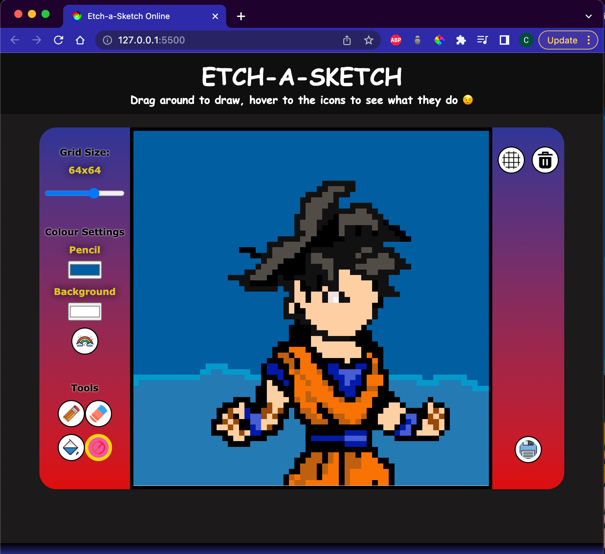
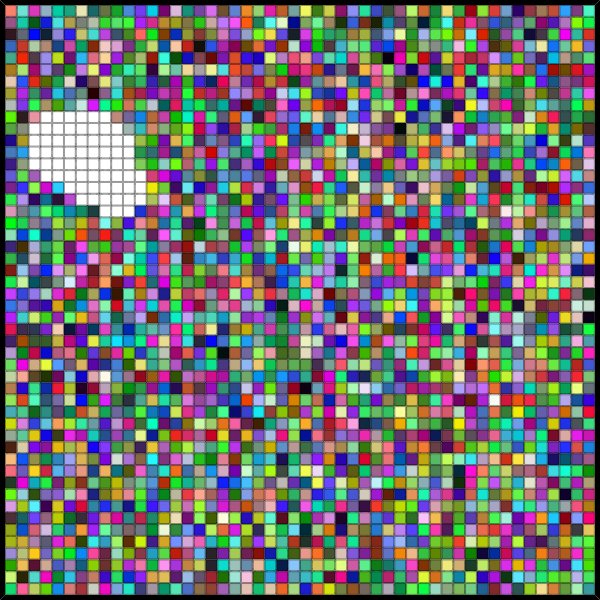
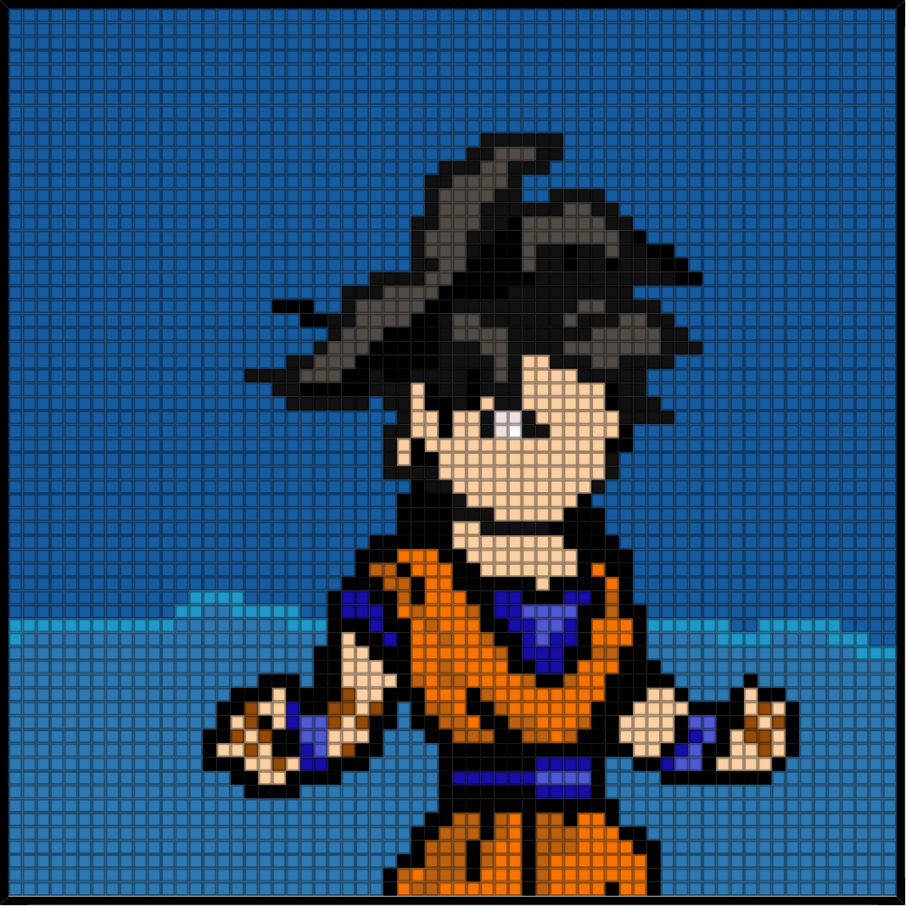

# Etch-a-Sketch Drawing tool
An online drawing tool with a canvas of scalable pixel-like grids.

[Link to page](https://caykay.github.io/Etch-A-Sketch-Online/)

## Features

### Change pixel size
You can choose how many pixels to be rendered within the canvas from the slider tool on the left sidebar

### Colour settings
You can pick whichever drawing colour you desire from the colour picker tool on the left pane

You can also change the background colour

### Rainbow feature
Click on the rainbow icon on the left sidebar and make trails of random colours on your canvas.

You can even make confetti pixel art by using the fill tool.

### Drawing tools
**_Pencil_**: typical and default drawing tool

**_Eraser_**: allows you to undo the selected trail marks, simply click on the eraser button and drag/click around the pixes you wish to erase

**_Fill_**: Fills an enclosed area within the pixel canvas with the current colour selections (that includes rainbow colours)

Here's a saved pixel art of a goku made with the pencil, and fill

### Grid Lines
Toggle grid lines on/off

### Clear
Use the bin button to delete/clear the current canvas

### Save
You can save your canvas as a png image to your device

## CREDITS
Find links to sources at the bottom of the web page